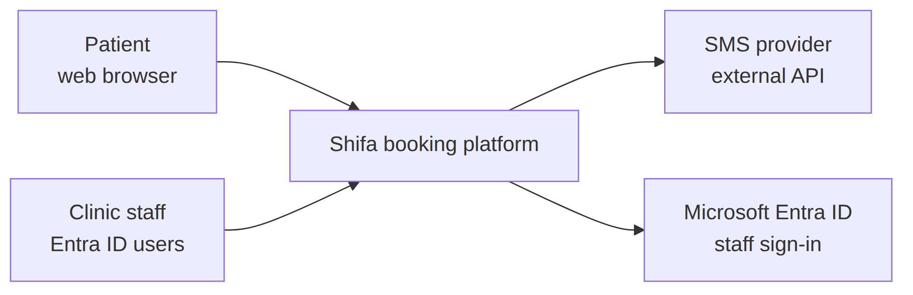
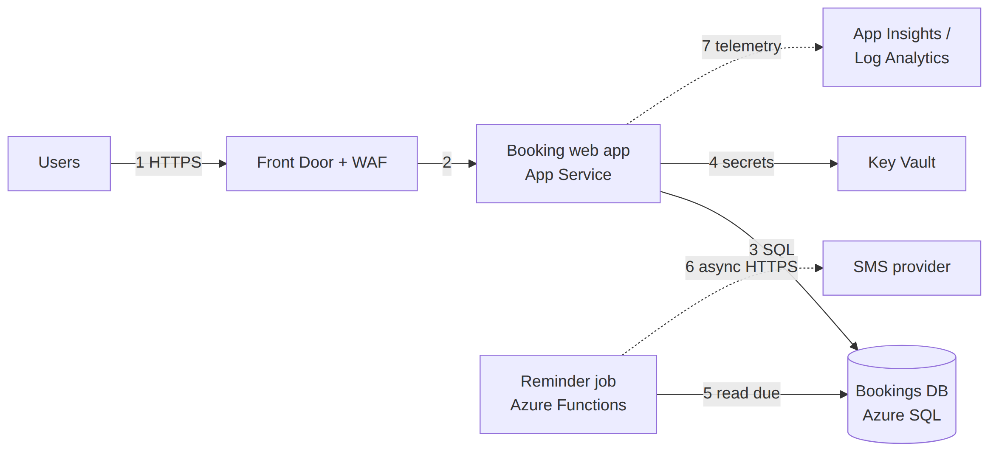
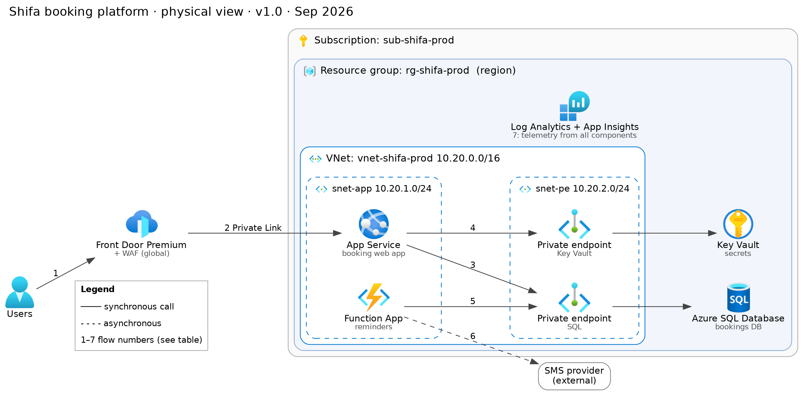

# Shifa Clinics Booking Platform — Solution Architecture Document (SAD Lite)
Team: Instructor example | Version: 1.0 | Date: (class date)

> This is a completed example for a DIFFERENT project than Tasreeh, used as
> the worked example in class. It shows the standard of finish expected —
> not something to copy for your own SAD.

## 1. Summary
This system helps patients at Shifa Clinics to book, change and cancel
appointments online instead of by phone. It runs on Azure App Service and
Azure SQL Database in the UAE North region (moving to Saudi Arabia East once
available). It costs about 4,800 SAR per month in production. The main risk
is that Saudi Arabia East may open later than planned.

## 2. Scope
In scope:
- Patient booking web app (view slots, book, change, cancel)
- Staff schedule view per clinic
- SMS confirmations and 24-hour reminders

Out of scope:
- Payments
- Electronic medical records
- Mobile apps and Nafath login (phase 2)

## 3. Requirements

| ID | Requirement | Source |
| --- | --- | --- |
| FR-01 | Patient can view free slots by clinic, doctor and date | Client interview |
| FR-02 | Patient can book, change or cancel up to 2 hours before | Client interview |
| FR-03 | Patient receives an SMS confirmation within 60 s of booking | Client interview |
| FR-04 | Patient receives an SMS reminder 24 hours before | Client interview |
| FR-05 | Staff can see and edit the day's schedule per clinic | Client interview |
| NFR-01 | Availability must be 99.9%, measured monthly | Client interview |
| NFR-02 | 95% of pages must load in under 2 s at 500 concurrent users | Client interview |
| NFR-03 | System must handle 3× normal load on Ramadan evenings | Client interview |
| NFR-04 | RPO must be 15 minutes, RTO must be 4 hours | Client interview |
| NFR-05 | Interface must support Arabic (RTL) and English | Client interview |
| C-01 | Patient personal and health data must stay in Saudi Arabia | Brief / PDPL |
| C-02 | Staff sign in with the existing Microsoft Entra ID tenant | Brief |
| A-01 | We assume an approved Saudi SMS provider offers an HTTPS API. To confirm with procurement. | Team |

## 4. Context diagram

## 5. Logical architecture

| Flow | From → To | What happens | Sync / Async |
| --- | --- | --- | --- |
| 1–2 | Users → Front Door → App Service | Request reaches the app through Front Door (WAF) over Private Link | Sync |
| 3 | App Service → Azure SQL | App reads/writes bookings using its managed identity | Sync |
| 4 | App Service → Key Vault | App reads the SMS API key via managed identity | Sync |
| 5–6 | Function → Azure SQL → SMS provider | Timer function finds bookings due in 24h and sends reminders | Async |
| 7 | App Service → Log Analytics | Telemetry from all components | Async |

## 6. Physical architecture

Region: UAE North (moving to Saudi Arabia East, see ADR-0001)
Subscription: sub-shifa-prod   Resource group: rg-shifa-prod

## 7. Data

| Dataset | Classification | Store | Location | Leaves the Kingdom? |
| --- | --- | --- | --- | --- |
| Patient name, phone, ID number | Confidential (personal) | Azure SQL | Saudi Arabia (target) | No |
| Appointment reason | Restricted (health) | Azure SQL, column encrypted | Saudi Arabia (target) | No |
| App logs (no personal data) | Internal | Log Analytics | Same region | No |

## 8. Security

- [x] Managed identities used by: App Service, Function App
- [x] Private endpoints for: Azure SQL, Key Vault
- [x] No public network access to: Azure SQL, Key Vault
- [x] WAF protects: Front Door (prevention mode)
- [x] Secrets stored in: Key Vault
- [ ] Uploaded files scanned by: n/a — Shifa has no file uploads

Compliance (NCA / PDPL): patient data classified as personal and health data
under PDPL; see ADR-0001 for the region decision that keeps it in the
Kingdom once Saudi Arabia East is available.

## 9. Reliability and cost

Target: 99.9% = (1 − 0.999) × 43,200 = 43 min downtime per month

Composite SLA: 99.99% (Front Door) × 99.95% (App Service) × 99.99% (Azure SQL)
= 99.93% = ~30 min per month. Meets target? Yes

RTO target: 4 hours   RPO target: 15 minutes

| Failure | How we recover | RTO achieved | RPO achieved | Meets? |
| --- | --- | --- | --- | --- |
| Zone outage | Zone-redundant App Service and Azure SQL | Typically < 30 s | 0 | Yes |
| Data deleted | Azure SQL point-in-time restore | ≈ 1 h 45 min (detect+decide+restore+verify) | ≤ 10 min (log backups every 5–10 min) | Yes |
| Region outage | Geo-restore + Terraform redeploy | Hours | Minutes to hours | No — accepted risk; cross-region recovery would move patient data outside the Kingdom (see R-04) |

| Environment | Monthly cost (SAR) | Main cost driver |
| --- | --- | --- |
| dev | ~600 | Small App Service plan, Basic SQL tier |
| prod | ~4,800 | P1v3 ×2 App Service plan, zone-redundant SQL, Front Door Premium |

Pricing Calculator link: (team's saved estimate link goes here)

## 10. Decisions

| ADR | Decision (one line) | File |
| --- | --- | --- |
| 0001 | Build in UAE North with synthetic data now; move to Saudi Arabia East once open | adr/0001-region.md |
| 0002 | Use App Service, not AKS, for a 3-person team | adr/0002-compute.md |
| 0003 | Use Azure SQL, not Cosmos DB, because bookings are relational | adr/0003-database.md |

## 11. Risks

| Risk | Impact (H/M/L) | Mitigation | Owner |
| --- | --- | --- | --- |
| R-01: Saudi Arabia East opens later than planned | H | Confirm service list monthly; keep Terraform region-agnostic | Lead architect |
| R-02: SMS provider outage | M | Retry with back-off; show confirmation on screen as fallback | Dev lead |
| R-03: Ramadan traffic exceeds forecast | M | Autoscale to 6 instances; load test before Ramadan | Ops lead |
| R-04: Region outage exceeds RTO/RPO | H | Accepted: in-Kingdom residency rules out a second region today; zone redundancy covers datacenter failures; review when a second Saudi region exists | Lead architect |

## Appendix A. Operations and deployment

Same pattern as the team template — Terraform in `infra/`, GitHub Actions
`design-checks` workflow, four alerts (availability, response time, failed
notifications, and — for Tasreeh's case — malware detections), all logs to
one Log Analytics workspace with 90-day retention.
